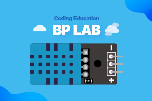

> [👈 Back](../README.md)

# DHT11 Extension for MakeCode



This extension allows you to read temperature and humidity data from a DHT11 sensor with the micro:bit.

This extension is an enhanced version of the code originally developed under the MIT License by [tinkertanker/pxt-iot-environment-kit](https://github.com/tinkertanker/pxt-iot-environment-kit.git).

We sincerely appreciate the efforts of the original developers who created the foundation for this extension.

## 🚀 Features

- Easy to read temperature (°C/°F) and humidity values from DHT11 sensor
- Supports both micro:bit V1 and V2 hardware versions
- Built-in timeout protection for stable readings
- Can be registered as a MakeCode extension for easy use
- Support for Korean

## Blocks

### 1. DHT11 Value Block

- 🔹 Description

  - Reads temperature or humidity value from DHT11 sensor
  - Supports both Celsius and Fahrenheit temperature readings
  - Automatically handles different micro:bit hardware versions

- 🔹 Parameters

  - `dht11type`: Type of reading (temperature °C/°F or humidity)
  - `dht11pin`: Digital pin where DHT11 sensor is connected

- 🔹 Returns

  - For temperature (°C): Returns temperature value in Celsius with one decimal place
  - For temperature (°F): Returns Fahrenheit value converted from Celsius reading
  - For humidity: Returns humidity percentage with one decimal place

- 🔹 Internal behavior

  1. Sends start signal to DHT11
  2. Reads 40 bits of data from sensor
  3. Validates checksum
  4. Converts raw data to temperature/humidity values

- ✅ Usage examples

  ```blocks
  let tempC = bplab.dht11.dht11value(DigitalPin.P0, dht11.DHT11Type.temperatureC)
  let tempF = bplab.dht11.dht11value(DigitalPin.P0, dht11.DHT11Type.temperatureF)
  let humidity = bplab.dht11.dht11value(DigitalPin.P0, dht11.DHT11Type.humidity)

  basic.showNumber(tempC)
  basic.showNumber(tempF)
  basic.showNumber(humidity)
  ```

## 📜 License

MIT License

## 💡 About BPLab

BPLab is a specialized company that provides coding education that anyone can easily learn. We provide in-person and online coding education for children, teens, adults, institutions, organizations, small groups, and schools in Korea in various fields such as IoT, artificial intelligence, micro:bit and Arduino.

We are also leading the way in developing and distributing coding education kits that allow learners to build, program, and experience the principles of coding. These kits utilize microcontrollers such as Arduino and micro:bit, as well as various sensors. This micro:bit extension is available for use in courses taught by BPLab.

Visit our websites:

- Korea: [https://bplab.kr](https://bplab.kr)
- Global: [https://bplab-us.com](https://bplab-us.com)
- Japan: [https://bplab-jp.com](https://bplab-jp.com)

## 📍 Supported targets

- for PXT/microbit

<script src="https://makecode.com/gh-pages-embed.js"></script><script>makeCodeRender("{{ site.makecode.home_url }}", "{{ site.github.owner_name }}/{{ site.github.repository_name }}");</script>
