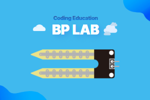

# Soil Moisture Sensor with LM393 Extension for MakeCode



This extension allows you to easily measure soil moisture levels using an LM393-based soil moisture sensor with the micro:bit.

## 🚀 Features

- Easy reading of soil moisture levels with micro:bit
- Support for both raw analog values and percentage readings
- Simple connection through analog pins
- Automatic value mapping to meaningful percentage readings
- Can be registered as a MakeCode extension for easy use
- Support for Korean

## Blocks

### Soil Moisture Value Block

- 🔹 Description

  - Reads soil moisture level from the LM393-based sensor
  - Supports multiple analog pins (P0, P1, P2)
  - Provides readings in two value types:
    - Raw analog values (0-1023)
    - Percentage values (0-100%)

- ✅ Usage example

  ```blocks
  let raw = soilMoisture.soilMoistureValue(soilMoisture.SoilMoisturePin.P0, soilMoisture.ValueType.RAW)
  let percentage = soilMoisture.soilMoistureValue(soilMoisture.SoilMoisturePin.P0, soilMoisture.ValueType.PERCENTAGE)

  basic.showNumber(raw)
  basic.showNumber(percentage)
  ```

## 📝 How It Works

The soil moisture sensor uses the LM393 comparator and two probes that measure electrical resistance in the soil. The resistance varies with moisture content:

- Dry soil has high resistance
- Wet soil has low resistance

The sensor provides an analog output that is inversely proportional to soil moisture:

- Higher values (around 800-1023) indicate dry soil
- Lower values (around 300-400) indicate wet soil

The extension automatically maps these values to a more intuitive 0-100% scale.

## 📜 License

MIT License

## 💡 About BPLab

BPLab is a specialized company that provides coding education that anyone can easily learn. We provide in-person and online coding education for children, teens, adults, institutions, organizations, small groups, and schools in Korea in various fields such as IoT, artificial intelligence, micro:bit and Arduino.

We are also leading the way in developing and distributing coding education kits that allow learners to build, program, and experience the principles of coding. These kits utilize microcontrollers such as Arduino and micro:bit, as well as various sensors. This micro:bit extension is available for use in courses taught by BPLab.

Visit our websites:

- Korea: [https://bplab.kr](https://bplab.kr)
- Global: [https://bplab-us.com](https://bplab-us.com)
- Japan: [https://bplab-jp.com](https://bplab-jp.com)

## 📍 Supported targets

- for PXT/microbit

<script src="https://makecode.com/gh-pages-embed.js"></script><script>makeCodeRender("{{ site.makecode.home_url }}", "{{ site.github.owner_name }}/{{ site.github.repository_name }}");</script>
